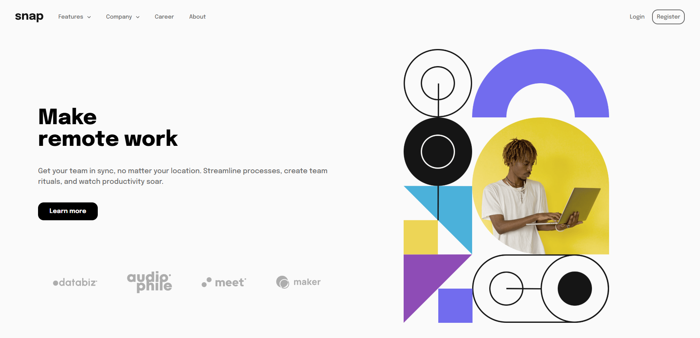

<h1 align="center"> Snap 💻 </h1>

## Status 🔧

I would like to rewrite and clean some of the code before fixing small details that feel wrong and add animations to make it prettier. 

However, I'm currently not working on this project anymore. I've grown unmotivated. Probably because it's a simple small webpage but I did some time expensive/stressful mistakes along the way.

I would stick here and take my time fixing everything to my liking or just drop it and start something fresh. I've choosen the former.

## Requirements 📄

These are the requirements for this project from frontendMentor challenges:

- View the relevant dropdown menus on desktop and mobile when interacting with the navigation links
- View the optimal layout for the content depending on their device's screen size
- See hover states for all interactive elements on the page (haven't done this)

## Alerts ⚡

- > [FrontendMentor Challenge Page](https://www.frontendmentor.io/challenges/intro-section-with-dropdown-navigation-ryaPetHE5)

- > [Live Project Link](https://snapintro.netlify.com)

## Goal 📌 

- Build projects for my angular portfolio.

---

<h3 align="center"> Home 📷 </h3>

    

<h3 align="center"> Tecnologias utilizadas 🤖 </h3>

 > 

 >   
 >   
 > 

